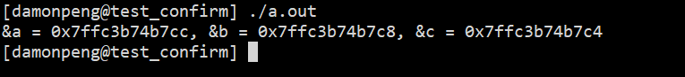

# C 可变参数

### 参数列表的构成

* 固定参数
* 可选参数  `...`

### 实现原理

```c
typedef char * va_list;

#define _INTSIZEOF(n)       ( (sizeof(n)+sizeof(int)-1) & ~(sizeof(int)-1) )

#define va_start(ap,v)        ( ap = (va_list)&v + _INTSIZEOF(v) )

#define va_arg(ap, type)    ( *(type *)((ap += _INTSIZEOF(type)) - _INTSIZEOF(type)) )

#define va_end(ap)             ( ap = (va_list)0 )
```

### Linux 进程内存结构布局


​		由Linux进程内存布局可以看出， 栈`由高地址向低地址`延伸， 而函数参数`由右向左`入栈，所以只需要知道函数栈顶的参数（函数的第一个参数）， 就能知道函数的整个参数列表， 这就是可变参数函数的原理。

```c
#include <stdio.h>
int test(int a, int b, int c)
{
    printf("&a = %p, &b = %p, &c = %p\n", &a, &b, &c);
    return 0;
}
int main()
{
    test(0, 0, 0); 
    return 0;                                                              
}
```

