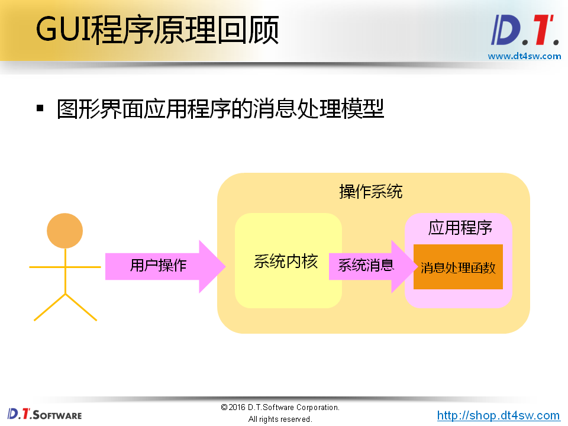

#GUI程序原理回顾

#Qt中的事件处理
###Qt平台将系统产生的消息转换为Qt事件
* Qt事件是一个QEvent的对象
* Qt事件用于描述程序内部或外部发生的动作
* 任意的QObject对象有具备事件处理的能力

###GUI应用程序的事件处理方式
1. Qt事件产生后立即被分发到QWidget对象
2. QWidget中的event(QEvent*)进行事件处理
3. event()根据事件类型调用不同的事件处理函数
4. 在事件处理函数中发送Qt中预定义的信号
5. 调用信号关联的槽函数

###场景分析：QPushButton按钮点击事件处理分析
1. 接收到鼠标事件
2. 调用event(QEvent*)成员函数
3. 调用mouseReleaseEvent(QMouseEvent*)成员函数
4. 调用click()成员函数
5. 触发信号SIGNAL(clicked())

###事件与信号的不同
* 事件由具体对象进行处理
* 信号由具体对象主动产生
* 改写事件处理函数可能导致程序行为发生改变
* 信号是否存在对应的槽函数不会改变程序行为
* 一般而言，信号在具体的事件处理函数中产生

__Qt程序在`main`函数创建`QCoreApplication`对象->
调用`exec()`开始事件循环 -> 事件发生，Qt创建一个事件对象->事件对象传递给`QObject`的`event()`函数 -> `event()`根据事件对象的类型分派给特定的事件处理函数__

###事件被组件对象处理后可能传递到其父组件对象

###QEvent中的关键成员函数
    //QEvent类的private成员变量
    ushort posted : 1;
    ushort spont : 1;
    ushort m_accept : 1;
    ushort reserved : 13;

    void ignore();     //接收者忽略当前事件，事件可能传递给父组件
    void accept();     //接收者期望处理当前事件
    bool isAccepted(); //判断当前事件是否被处理

###Qt中的事件过滤器
* 事件过滤器可以对其他组件接收到的事件进行监控
* 任意的QObject对象都可以作为事件过滤器使用
* 事件过滤器对象需要重写eventFilter()函数
* 组件通过installEventFilter()函数安装事件过滤器
  * 事件过滤器在组件之前接收到事件
  * 事件过滤器能够决定是否将事件转发到组件对象
* 事件过滤器的典型实现  

###bool QObject::eventFilter(QObject* watched, QEvent* event)
如果本对象安装有watched对象的事件过滤器，将会为watched对象过滤事件.eventFilter返回一个 bool 类型，如果你想将参数 event 过滤出来，比如，不想让它继续转发，就返回 true，否则返回 false。写里,如果想要过滤事件,返回true,否则返回false

###void QObject::installEventFilter(QObject* filterObj)
在当前对象安装filterObj过滤器。事件过滤器是一个接收所有发送到此对象事件的对象，

实现：

    bool Widget::eventFilter(QObject* obj, QEvent* e){
      if(/*根据obj判断对象*/) 
      {
        if(/*根据e->type()判断事件*/) 
        {
          /*事件处理逻辑*/
        }
      }
      /*调用父类中的同名函数*/
      return QWidget::eventFilter(obj,e);
    }

