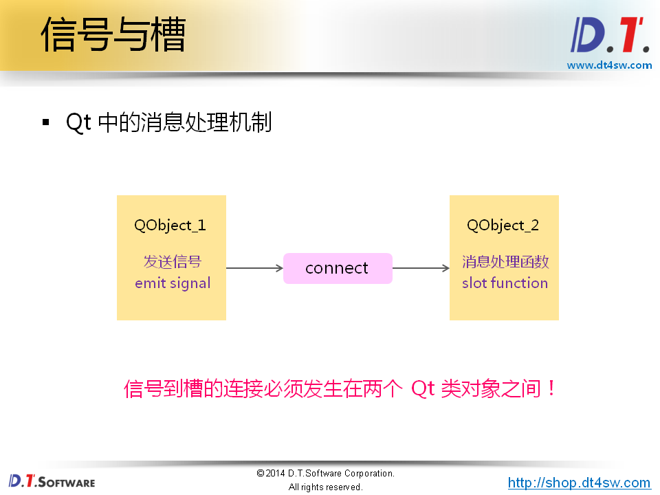

#Qt消息模型
* Qt封装了具体操作系统的消息机制
* Qt遵循经典的GUI消息驱动时间模型

#思考
* Qt中如何表示用户消息？
* Qt中如何映射用户消息到消息处理函数？
* Qt中消息映射需要遵循什么规则？

#信号与槽
Qt中定义了与系统消息相关的概念：

* 信号：由操作系统产生的消息
* 槽：程序中的消息处理函数
* 连接：将系统消息绑定到消息处理函数

##Qt中的消息处理机制
