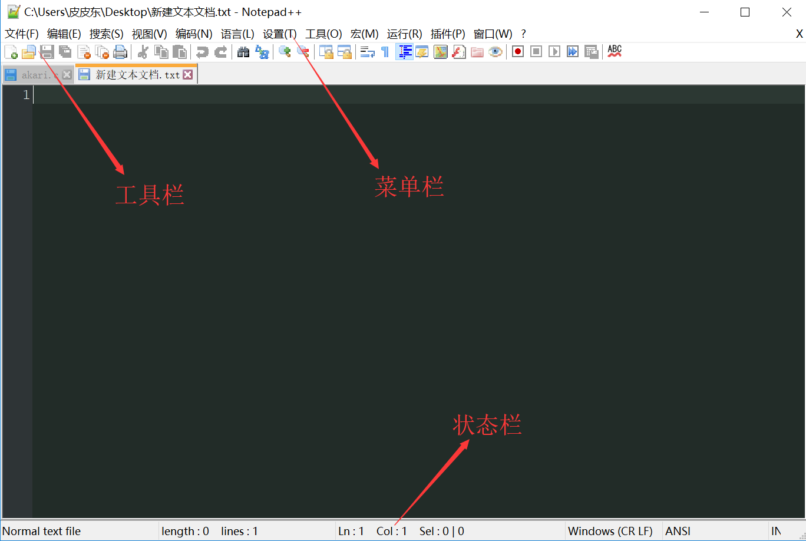
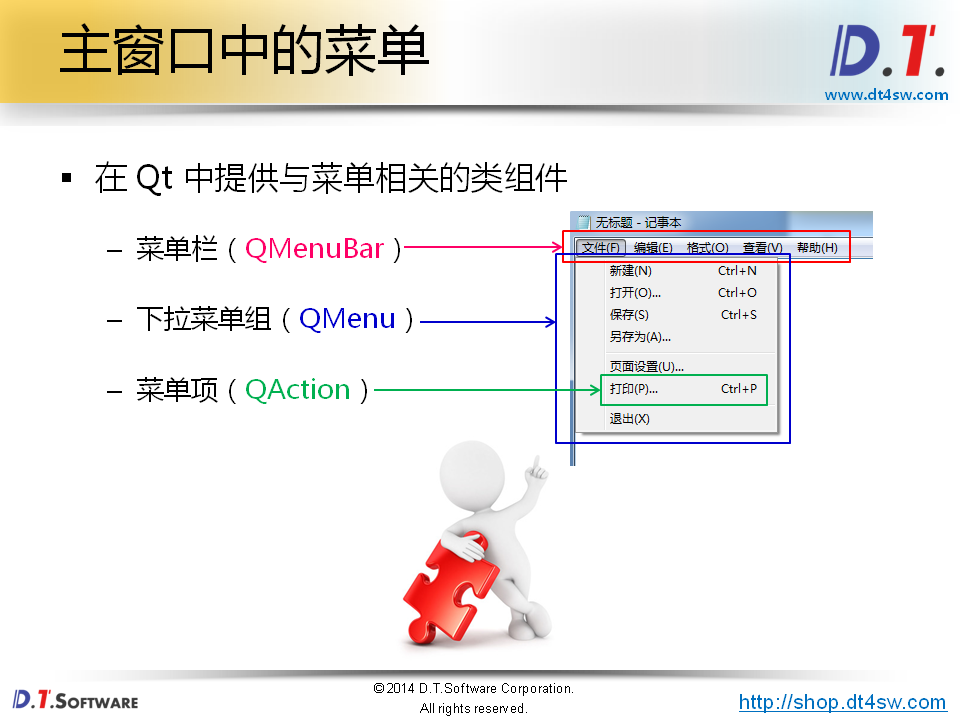

#应用程序中的主窗口
* 主窗口是与用户进行长时间交互的顶层窗口
* 程序的绝大多数功能直接由主窗口提供
* 主窗口通常是应用程序启动后显示的第一个窗口
* 整个程序由一个主窗口和多个对话框组成

##Qt中的主窗口
* Qt开发平台中直接支持主窗口的概念
* QMainWindow是Qt中主窗口的基类
* QMainWindow继承与QWidget是一种容器类型的组件

  

##小技巧
* 快捷键设置
  * QKeySequence Qt中与快捷键相关的类
  * KEY Qt中代表键值的常量

    action->setShortcut(QKeySequence(KEY));
