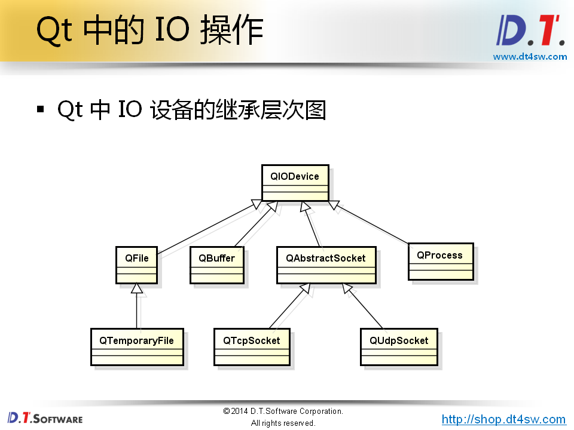

#Qt中IO操作的处理方式
* Qt通过统一的接口简化了文件与外部设备的操作
* Qt中的文件被看作一种特殊的外部设备
* Qt中的文件操作与外部设备的操作相同
* IO操作中的关键函数接口
  * 打开设备：bool open(OpenMode mode)
  * 读取数据：QByteArray read(qint64 maxSize)
  * 写入数据：qint64 write(const QByteArray& byteArray)
  * 关闭设备：void close()

__Qt中继承了Linux中"一切皆文件"的思想__ 

##Qt中IO设备的类型
* 顺序存取设备
  * 只能从头开始顺序的读写数据，不能指定数据的读写位置
* 随机存取设备
  * 可以定位到任意的位置进行数据的读写(seek function)

##QFile
* QFile是Qt中用于文件操作的类
* QFile对象对应到计算机上的一个文件

##QFileInfo
* QFileInfo类用于读取文件属性信息

实例代码

    #include <QCoreApplication>
    #include <QFile>
    #include <QByteArray>
    #include <QDebug>
    #include <QFileInfo>
    #include <QDateTime>
    #include <QString>
    #include <QDateTime>
    
    void write(QString f)
    {
      QFile file(f);
      if(file.open(QIODevice::WriteOnly | QIODevice::Text)){
        file.write("alksjdflkasjdflkjs\n");
        file.write("lkasjdflkjkljsadlkfjlksdf\n");
        file.close();
      }
    }
    
    void read(QString f)
    {
      QFile file(f);
      if(file.open(QIODevice::ReadOnly | QIODevice::Text)) {
        QByteArray ba = file.readLine();
        QString s(ba);
        qDebug() << s;
        file.close();
      }
    }
    
    void info(QString f)
    {
      QFile file(f);
      QFileInfo info(file);
    
      qDebug() << info.exists() << info.isFile() <<
      info.isReadable() << info.isWritable();
      qDebug() << info.lastRead();
      qDebug() << info.lastModified() << endl;
      qDebug() << info.path() << info.fileName() << info.suffix() <<
      info.size();
    }
    
    int main(int argc, char *argv[])
    {
      QCoreApplication a(argc, argv);
    
      write("D:/fortest/1.txt");
      read("D:/fortest/1.txt");
      info("D:/fortest/1.txt");
    
      return a.exec();
    }

##QTemporaryFile
* Qt中提供了临时文件操作类QTemporaryFile
* 安全地创建一个全局唯一的临时文件
* 当对象销毁时对应的临时文件将被删除
* 临时文件的打开方式为QIODevice::ReadWrite
* 临时文件常用于大数据传递或者进程间通信的场合

示例代码

    #include <QCoreApplication>
    #include <QTemporaryFile>
    #include <QFileInfo>
    #include <QDebug>
    
    int main(int argc, char** argv)
    {
      QCoreApplication a(argc, argv);
      QTemporaryFile tempFile;
    
      if(tempFile.open()){
        tempFile.write("tempfile");
        tempFile.close();
      }
      QFileInfo info(tempFile);
      qDebug() << info.isFile();
      qDebug() << info.path();
      qDebug() << info.fileName();
    
      return a.exec();
    }
