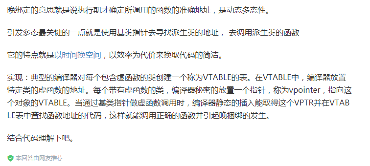

# 关于对象

__在C++中，有两种class data members: statis和nonstatis，以及三种class member functions: statis, nonstatis和virtual。__

# C++程序设计模型直接支持三种programming paradigms(程序设计范式)：

## 1. 程序模型(procedural model)
## 2. 抽象数据类型模型(abstruct data type model,ADT)(现被称为OB:object-based)
## 3. 面向对象模型(object-oriented model)

__C++中凡处于同一个access section的数据，必定保证以其声明顺序出现在内存布局当中。__

__base classes 和 derived classes 的 data members的布局也未有谁先谁后的强制规定。__

__组合，而非继承，才是把C和C++ 结合在一起的唯一可行的方法。__

> ​	C struct在C++中的一个合理用途，是当你要传递“一个复杂的class object的全部或部分”到某个C函数去时，struct声明可以将数据封装起来，并保证拥有与C兼容的空间布局。

__原则上，被指定的object的真实类型在每一个特定执行点之前，是无法解析的。在C++中，只有通过pointer和reference的操作才能够完成。__

#### 多态

> ​	多态的主要用途是经由一个共同的接口来影响类型的封装，这个接口通常被定义在一个抽象的base class中。这个共享接口是以virtual function机制引发的，它可以在执行期根据object的真正类型解析出到底是哪一个函数实例被调用。

#### class object占用内存的影响因素

* 非静态成员变量的大小
* 内存对齐
* 为了支持virtual所产生的额外内存

#### 指针的类型

> ​	“指向不同类型之各指针”间的差异，既不在期指针表示法不同，也不在其内容不同，而是在其所寻址出来的object类型不同。也就是说，“指针类型”会教导编译器如何解释某个特定地址中的内存内容及其大小。

* 一个类型为void*的指针只能够持有一个地址，而不能通过它操作所指向的object
*  类型转换不改变一个指针所含的真正地址，只影响“被指出的内存的大小和其内容”的解释方式

> ​	一个pointer或一个reference之所以支持多态，是因为它们并不引发内存中任何“与类型有关的内存委托操作(type-dependent commitment)”；会受到改变的，只有它们所指向的内存的“大小和内容解释方式”而已。

> ​	C++通过class的pointers和reference来支持多态，这种程序设计风格就称为“面向对象”。