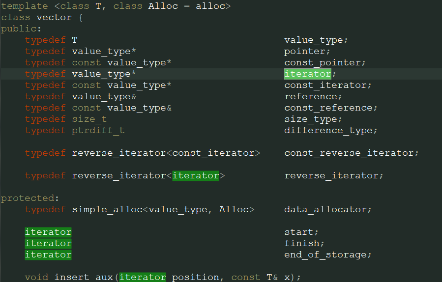

##vector

  
vector是可以动态改变大小的顺序容器，所以在进行元素的插入操作时迭代器可能失效。因为插入后如果vector先有内存不能满足需求，会更换一片新的更大的内存，所以原先迭代器所指向的内存空间将失效，迭代器操作失效的内存将会照成内存错误。如果插入过程中内存满足需求没有进行内存重分配，迭代器所指向的内存空间为有效空间。
删除操作也有可能造成迭代器的部分失效，指向删除元素之前的迭代器仍有效，但是指向删除元素之后的迭代器将会失效。