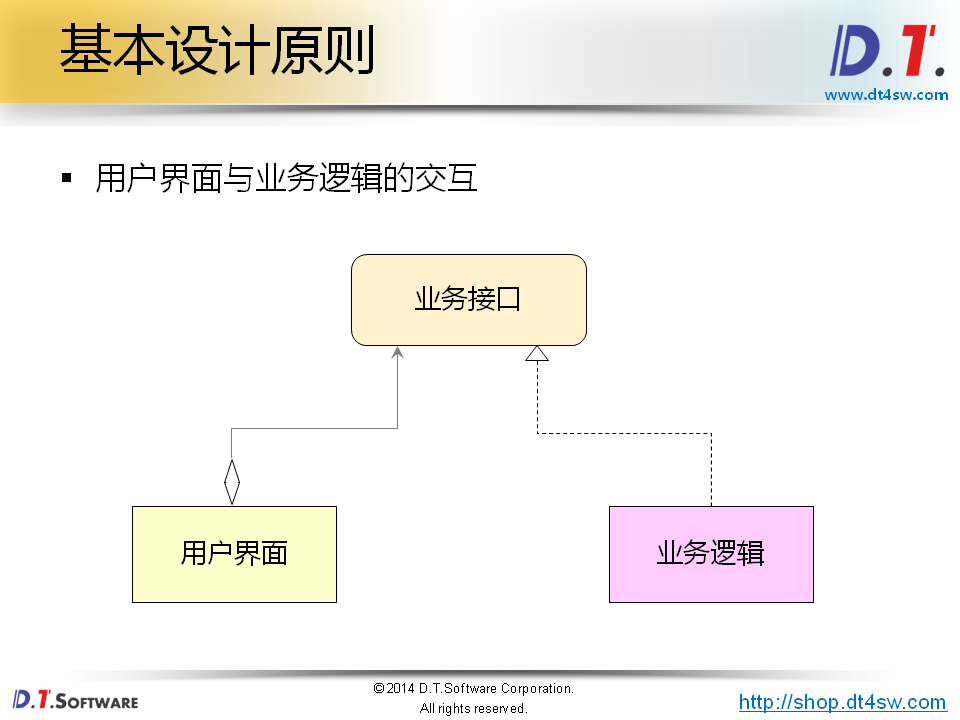
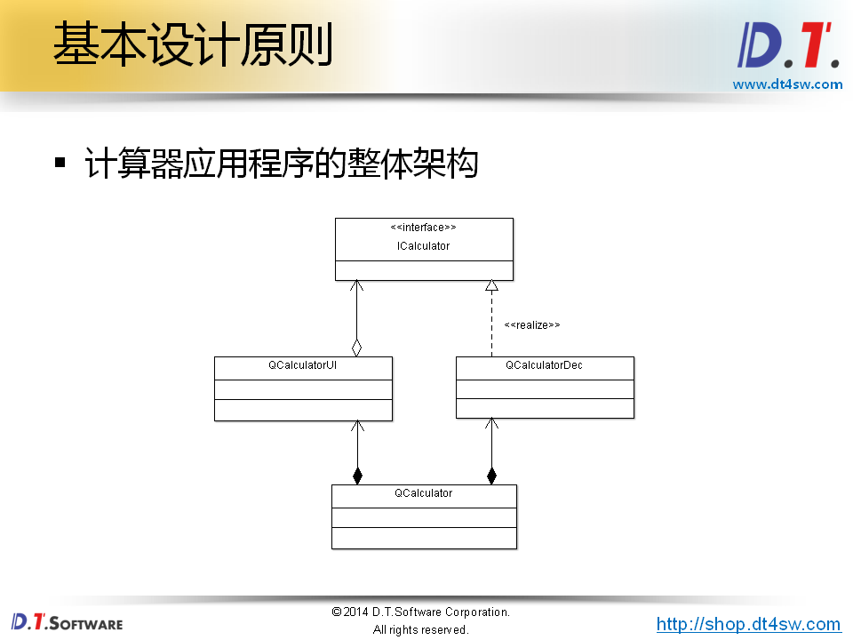

#用户界面与业务逻辑的分离

##基本程序结构一般包括
* 用户界面模块(UI)用于接受用户输入及呈现数据
* 业务逻辑模块(Business Logic)根据用户需求处理数据

##用户界面与业务逻辑如何交互？
###基本设计原则
* 功能模块之间需要进行解耦
* 核心思想：__强内聚，弱耦合__
  * 每个模块应该只实现单一的功能
  * 模块内部的子模块只为整体的单一功能而存在
  * 模块之间通过约定好的接口进行交互

###在工程开发中接口是什么？
* 广义：
  * 接口是一种契约(协议、语法、格式等)
* 侠义：
  * 面向过程：接口是一组预定义的函数模型
  * 面向对象：接口是纯虚类(C#和java直接支持接口)

###模块之间仅通过接口进行关联
* 必然存在模块会使用接口
* 必然存在模块实现对应的接口
###模块间的关系是单向依赖的
* 避免模块间存在循环依赖的情况
* 循环依赖是糟糕设计的标准之一

__ICalculator为计算器程序的抽象接口，提供用于继承的的`expression`,`result`接口，CalculatorDec将继承自ICalculator实现具体的计算功能。CalculatorUI为计算器程序提供界面，内部有指向ICalculator的指针。Calculator为计算器实体，内部有指向二阶构造出来的CalculatorUI对象，由m\_ui指向，并定义了用于实际计算的CalculatorDec对象，通过m\_ui为程序界面设定计算实例。__